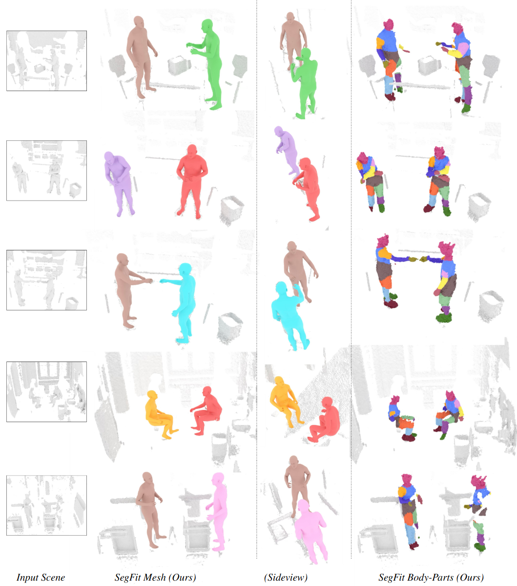

# SegFit: Robust Human Mesh Fitting on In-the-Wild Point Clouds with Body Part Segmentation

## Installation
First, clone this repository recursively: `git clone --recurse-submodules git@gitlab.com:kai.lascheit.000/segfit.git`
Then set up the environment as detailed on the [Human3D](https://github.com/human-3d/Human3D) repository. 
Finally, run `pip install -r requirements.txt`.

## Input Format
The input path should point to a directory containing PLY files. As neither Human3D nor SegFit require color information, it is sufficient if the PLYs contain only the vertex coordinates. The SMPL-X ground truth path can be omitted. If provided, it should point to a directory containing PKL files with names corresponding to the PLYs. If a scan contains multiple humans and, therefore, multiple ground truth PKLs exist for the scan, make sure that their filenames follow the convention "*'ply-filename'.pkl".

## Running
Simply run with:
`python segfit.py --input_path=<input_path> --human3d_ckpt=<checkpoint_path> --is_input_z_up=<True/False> --smplx_gt_dir=<path_to_SMPLX_ground_truths`
The `is_input_z_up`parameter defaults to `True` and providing SMPLX ground truth parameters is optional. If using the Hi4D dataset, also add the `--is_hi4d` flag for correct coordinate system alignment.

## Example
Run: `python segfit.py --input_path=/home/klascheit/code/segfit/example/egobody/scans/ --human3d_ckpt=ckpts/human3d.ckpt --is_input_z_up=False --smplx_gt_dir=/home/klascheit/code/segfit/example/egobody/truths/`.

## Acknowledgements
The pretrained checkpoint for Human3D is taken from the official [Human3D](https://github.com/human-3d/Human3D) repository.